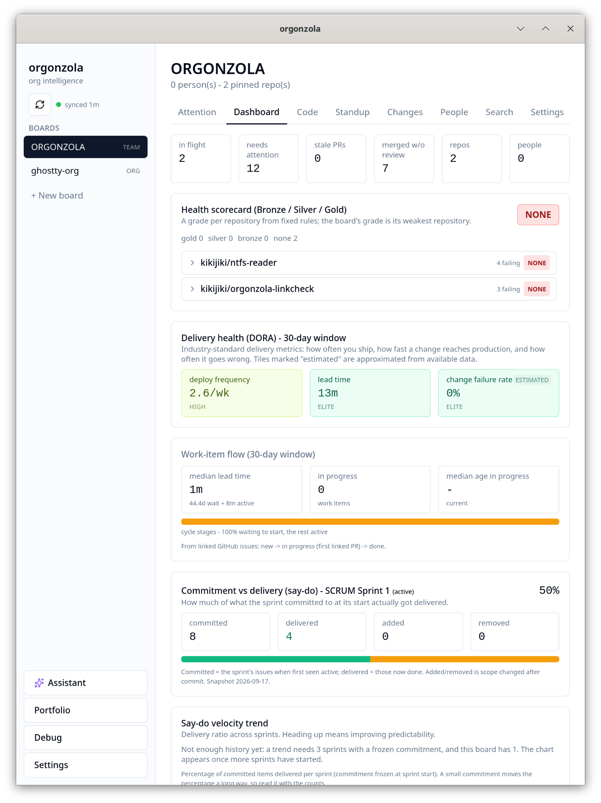
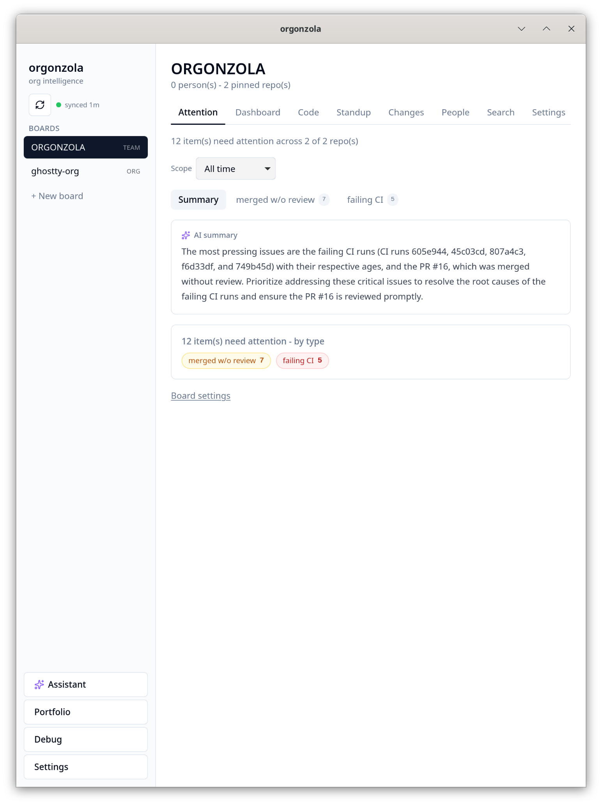
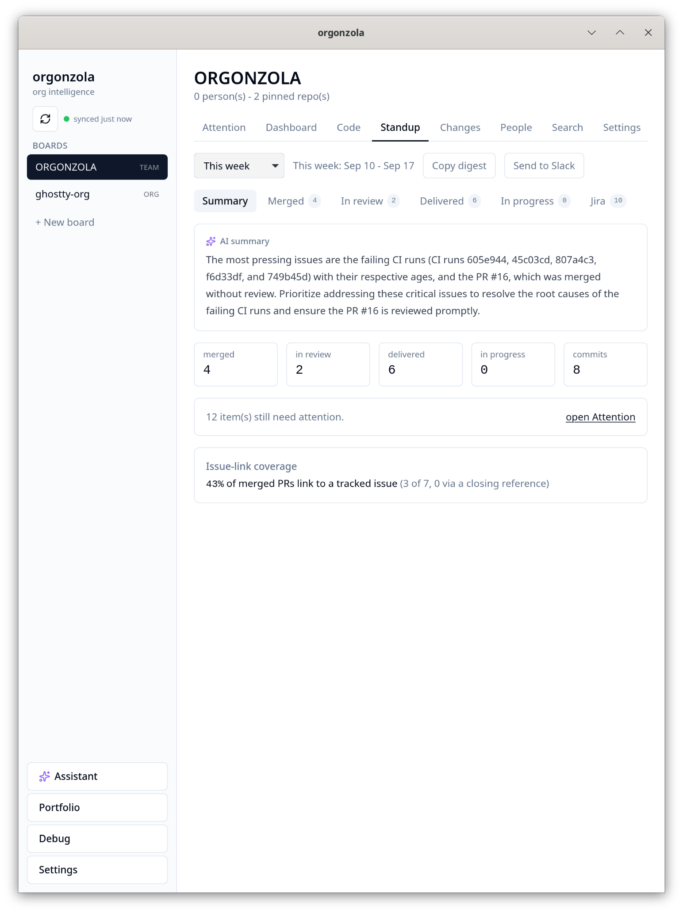
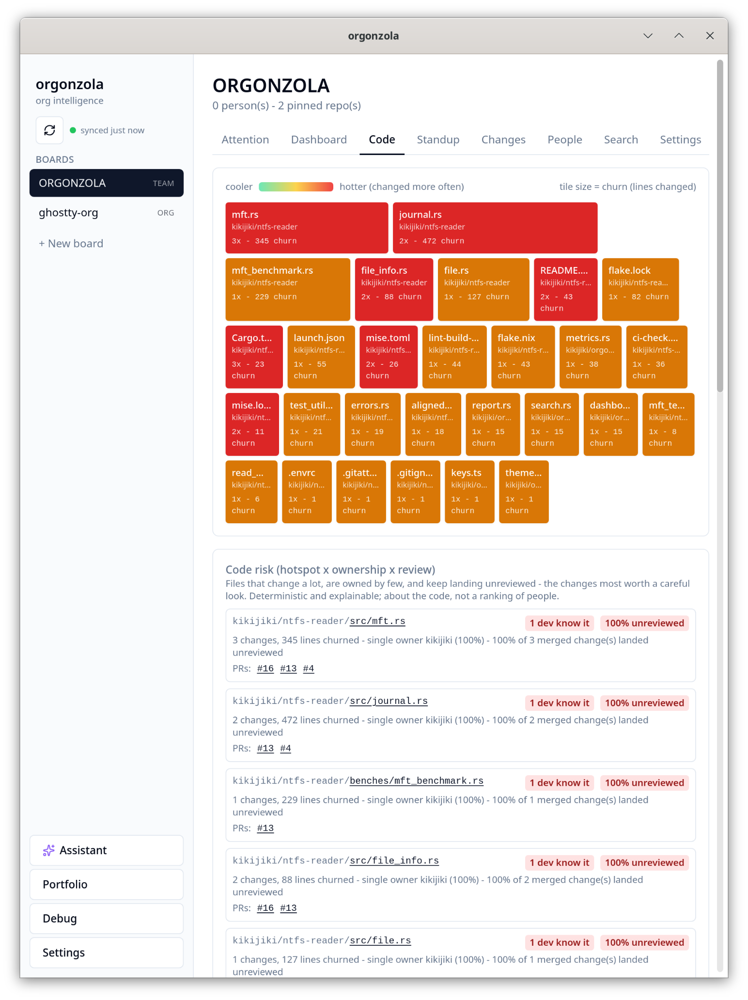

# orgonzola

A desktop app that syncs a GitHub or Gitea org into a local database and reports on it: what needs
attention, what is stuck, what shipped, how work is flowing. Built for tech leads and engineering
managers.

It runs on your machine. SQLite for the data, a local embedding model for code search, a local LLM
for the optional assistant. Network calls beyond your forge are labelled and opt-in.



## What it does

- Boards scoped to a team, a repo, or an org. Team boards discover repos from the people on them.
- An attention list from deterministic rules: stale PRs, merges without review, review load on one
  person, failing CI on main, releases with no linked work, upstream breaking changes.
- Standup agendas, sprint review, retro input, and mid-sprint health, all from activity rather than
  self-report.
- Flow metrics: cycle time, time to first review, review wait, WIP aging, say/do velocity, DORA lead
  time.
- Semantic code search over an incremental AST-aware index, a dependency graph for cargo/npm/pip/go,
  and a code-risk score.
- A tool-using assistant over the same data. Everything above is computed in Rust, so it all works
  with the LLM off.
- Jira as a read-only tracker joined to forge activity.

## Screenshots







## Build

```sh
nix develop        # Rust, Node, and the WebKitGTK stack, pinned
just               # list the recipes
just ui-install    # once
just run           # cargo tauri dev
```

Checks, same ones CI runs:

```sh
just test        # cargo test --workspace
just clippy      # -D warnings
just ui-check    # tsc + biome + vitest
just docs-check  # markdown formatting, links, ASCII
```

Without Nix: Rust per [rust-toolchain.toml](rust-toolchain.toml), Node 22, pnpm 11, and the
WebKitGTK/GTK headers. [.github/workflows/ci-check.yml](.github/workflows/ci-check.yml) lists the packages.

## First run

Connect a forge (GitHub sign-in, or a token with `repo` and `read:org`), create a board and pick its
scope, then sync.

## Layout

```
core/   Rust: sync, schema, metrics, rules, retrieval, agent. No host dependencies.
hosts/  the Tauri shell. Owns the process, exposes core over typed commands and events.
ui/     React + Vite + Tailwind. View layer only.
```

The TypeScript bridge is generated by tauri-specta, so a changed Rust signature breaks the frontend
build instead of drifting. Core crates build and test headless.

## License

MIT - see [LICENSE](LICENSE).
